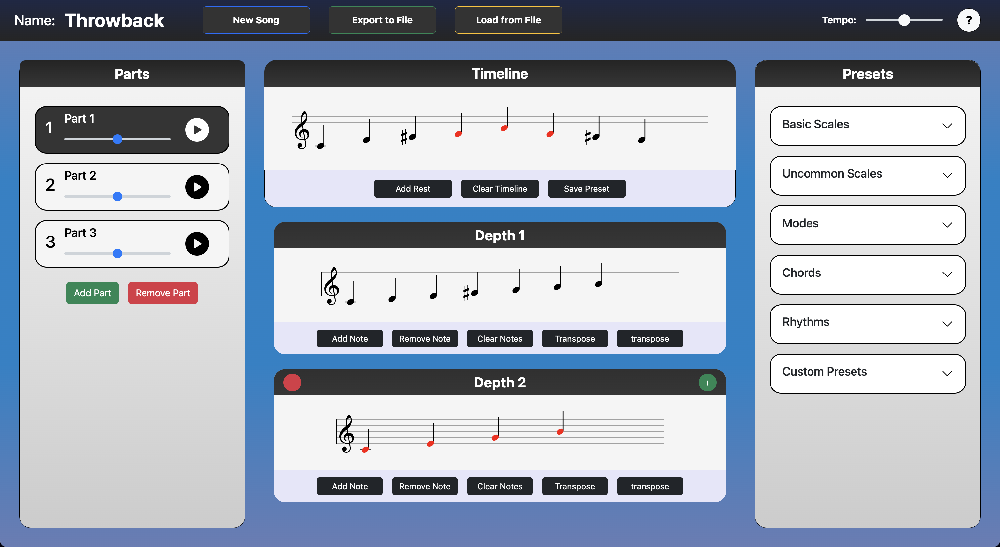
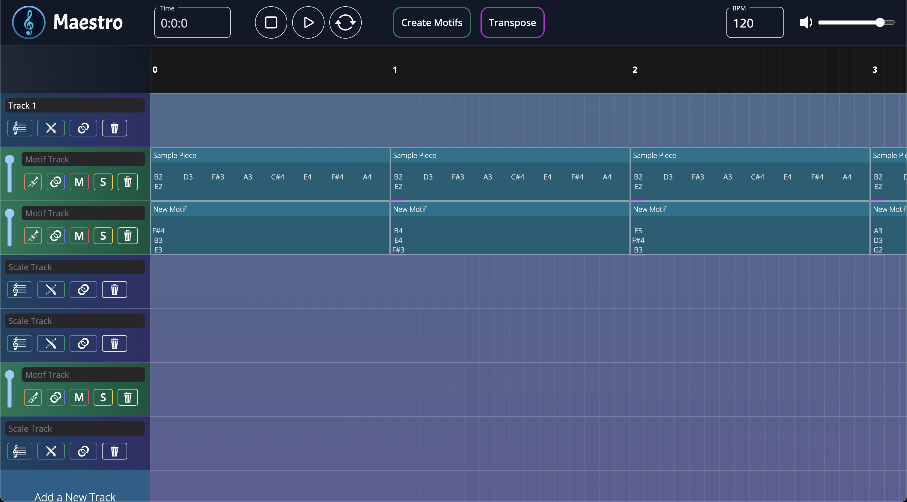
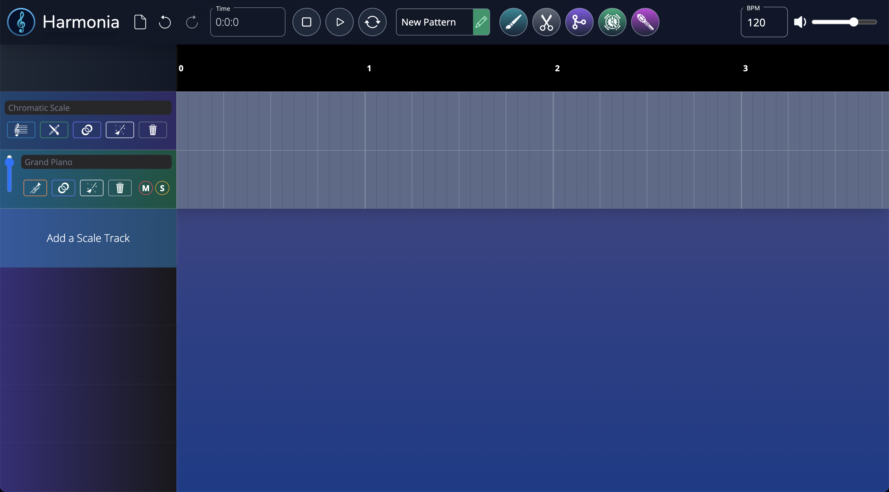
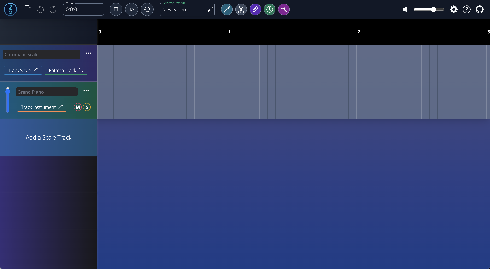
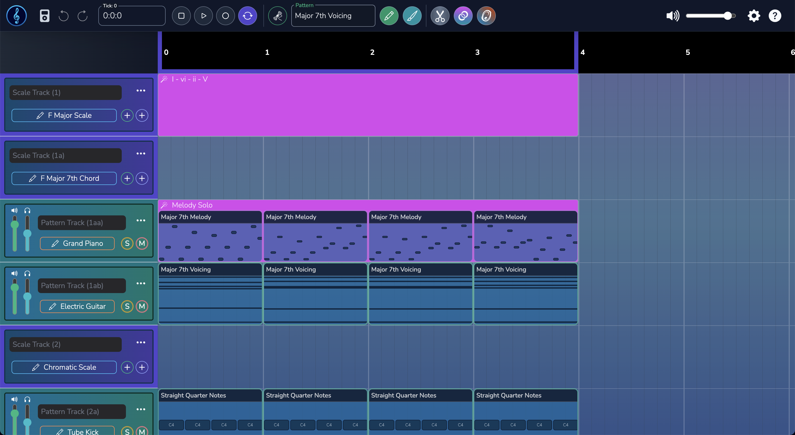
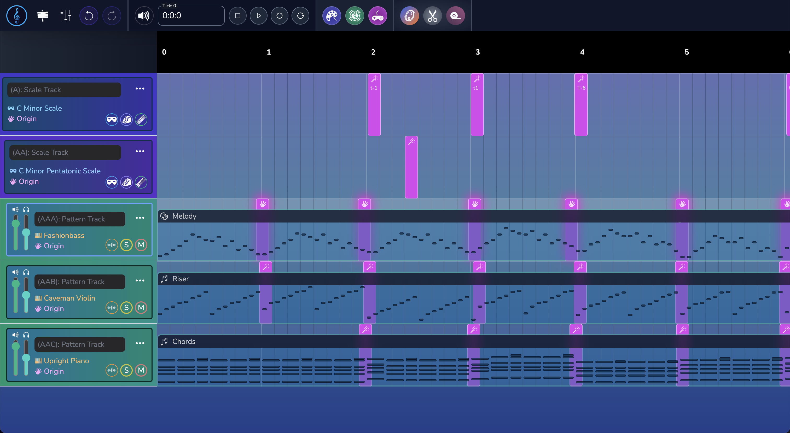

<h1 align="center">Senior Thesis Gallery</h1>

In this collection, you will find a series of screenshots that document the evolution of Harmonia from its inception in the fall of 2022 to its current form in the present day. I have included a brief description of each version of the website to provide context for the images. I hope that this gallery will give you a sense of the progress I have made on the project over the past two years and highlight my journey as a designer and developer. Enjoy!

<h2>Exhibit 1: ~Fall 2022</h2>

It's hard to believe but this is the first version of Harmonia! I started out this project by creating very simple musical data types and I threw together an interface with my limited understanding of browser audio. Nevertheless, the core logic of the website was born here: users
can arrange instrumental parts that play musical motifs constructed out of nested scales.

<h2>Exhibit 2: ~Winter 2022</h2>

And so the digital audio workstation was born! Or at least, my initial take on it, which I named Maestro for the time being. After a few months of experimentation, I realized that I needed to completely restructure my project in order to support the growing demands of the software. I spent a lot of time rewriting the codebase over winter break and ultimately I was attracted to the tried and true formula of the DAW. 

<h2>Exhibit 3: ~Spring 2023</h2>

This is what the website looked like when I ran my first focus group in college. It was also around this time that I officially named it Harmonia! I was starting to code more features than the interface could handle, and there were simply too many buttons for some people to understand. I learned a lot from this experience and it was rewarding to share my work with my friends.

<h2>Exhibit 4: ~Summer 2023</h2>

This is what the website looked like right around when I submitted my thesis. I had to take the gas pedal off my coding to write the paper, but I was still able to incorporate some of the feedback from my peers and advisors. I was really proud of the work I had done up to this point amidst the trials and tribulations of senior year and I was excited to graduate so that I could finally work on it without the pressure of a deadline.

<h2>Exhibit 5: ~Winter 2023</h2>

This is what the website looked like after I worked on it full-time for half a year after graduation. I decided to take a year off after college to do some soul-searching and reflect on my future, and so I was able to peacefully work on Harmonia and enter the flow state that I had long been craving.
Although I would not be accepted into any of the startup accelerators I applied for, I was still able to truly professionalize the website and implement long-desired features like user authentication and payment processing.

<h2>Exhibit 6: ~Fall 2024</h2>

This is the most recent version of the website, and I do believe that it is the best one yet. Although I am not able to work on the project full-time anymore, I am still trying to make it a little better every day that I can, whether it's just a small bug fix or a new feature. I am hopeful that I will be able to find a way to make Harmonia a sustainable project in the future, but for now I am just grateful to have the opportunity to work on it at all. I am excited to see where it goes from here.

